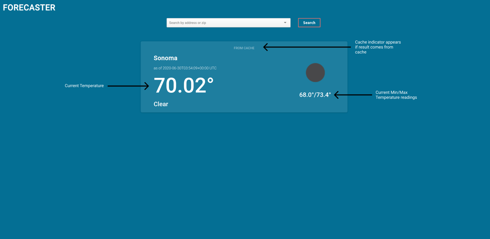

# Forecaster

* Ruby version: 2.6.6
* System dependencies: ruby, nodejs, yarn, build-essential, libpq-dev.
* Gem Dependencies: geocoder, rest-client
* Configuration: Make sure you have the `master.key` file in the `config/` directory.
* Live link: https://thawing-sierra-63383.herokuapp.com/

# Development

The project is containerized. You can run it with `docker-compose up` command.
Make sure you have placed the `master.key` file in the `config/` directory. 
There are a couple of useful Makefile commands that can help with rebuilding and managing the application.

Alternatively one can run the project as a regular RoR app. Make sure you have the right Ruby version and system dependencies installed.
Install your gems with `bundle install --path=vendor`, and stand up the app with `bundle exec rails s`.

# Application Problems

* There is only one very scarce test. Ideally both Geocoder and OpenWeatherAPI would be stubbed for the test suite. This would result in more detailed and thorough tests.
* Live version of the application is running in development mode :( (this causes a whole lot of problems)
* Docker containers are run as root.
* There is no code handling for unavailable services. The app will just ungracefully crash.
* No fallback is provided in the case of the Geocode not finding a location zipcode and country code.
* Requests to location#index should be throttled more.
* The searched address is not stored in the search field after a search.
* The search field is poorly done. Takes a while to load, and comes up with sometimes erroneous results.
* Weather card time data should be local to the search place.
* Cache is small, and unfit for a real production environment.
* Many others (especially if the app is run in production) :D

## Forecaster assignment:

### Requirements:
  * Must be done in Ruby on Rails ✔️
  * Accept an address as input ✔️
  * Retrieve forecast data for the given address.
    This should include, at minimum, the current temperature (Bonus points - Retrieve high/low and/or extended forecast) ✔️
  * Display the requested forecast details to the user ✔️
  * Cache the forecast details for 30 minutes for all subsequent requests by zip codes. ✔️
  * Display indicator if result is pulled from cache. ✔️
